# OnePlus-9008-JiuZhuan-Guide
一加/真我/OPPO (Oplus) 高通机型 9008 深刷救砖教程。OnePlus/Realme 9008 EDL Unbrick Guide. 免授权工具下载与使用指南 (Bypass Auth).
# 一加真我绿厂 9008 深刷免授权救砖教程

> **⚠️ 严重警告：**
> **一加、真我、绿厂（OPPO）的高通机型用户，千万别更新系统！！！**
> * 几乎所有高通机型都可以免授权 9008，8 至尊及以下均支持（8 尊 5 未知）。
> * 其中绿厂 X7U、X6P、N3 以及其他老高通机型可以解锁 BL，X8U 虽然可以 9008 但暂不支持解锁。
> * **升级系统会导致该机 9008 免授权被永久熔断，且降级无效！**
> * 升级过 9 月补丁的骁龙 8+、778G、768G、865、870 机型，已经被熔断（865、870 的熔断版本可能更早）。
> * 就算你的机器已经停更也不能幸免，OPPO 还会特意推一个小更新来进行熔断，**被熔断后终身无法恢复**。为了防止偷偷自动更新，你可以关掉系统更新app的联网权限，或者联系客服要求关掉更新。
> * **对于欧加真玩机来说，9008免授权非常重要，如果你的手机OCDT损坏（例如遭遇格机）售后无法帮你救砖，你必须拆字库才能救好。**
> *  **【2026.1.15 最新熔断警告】：一加 13 和一加 13T 已推送熔断版本，版本号是 16.0.3.501，如果更新了该版本，会导致 9008 免授权被永久不可逆熔断，终身无法恢复，其余机型也即将推送熔断版本。从 2026.1.14 开始，所有一加真我OPPO高通芯片手机请不要更新任何新版本否则都会永久不可逆熔断。**

> **关于 OPPO 高通机型解锁（除X8U和Pad4 Pro以外的现代机型均支持，前提是9008免授权没有被熔断）：**
> [Oplus-Qualcomm-Unlock-2026-Universal-Guide](https://github.com/AdaUnlocked/Oplus-Qualcomm-Unlock-2026-Universal-Guide)
> 蓝奏云链接内附带有几乎所有可解机型的资料以及教程的链接，x7u资料也已经提供信息补充。

*本教程原作者为酷安 @是林不是玲。由于酷安大量优质帖子无法在浏览器中搜索到，为了方便各位机友检索，故转载至 Github，感谢原作者对机圈做出的贡献。*

---

## 第一步：安装驱动

黑砖了？不怕，快用免授权把你的机器救回来吧！
刷机第一步必须先安装驱动，安装好了才可以开始刷机。
[点击下载驱动](https://www.123865.com/s/XKfLVv-E9U0?notoken=1)

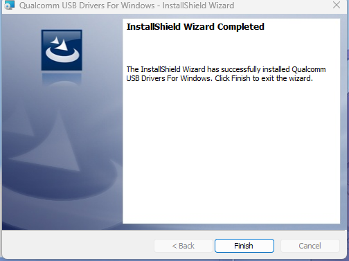

---

## 第二步：准备工作

准备好数据线（建议拿原装的数据线）。先下载好深刷散包（是一种特殊的救砖包，和普通线刷包不同）（本文演示的是一台一加平板 Pro）。
请前往下载自己型号的刷机包：[点击查看链接](https://www.123865.com/s/XKfLVv-Q9U0?notoken=1) 
如果你的手机是真我，可以在这里找一下自己的机型链接，比较乱，但挺全的：https://drive.google.com/file/d/1-7WOAxdo1IP_-l4YT0V_4OuJYWXjsMXZ/view?usp=drive_link

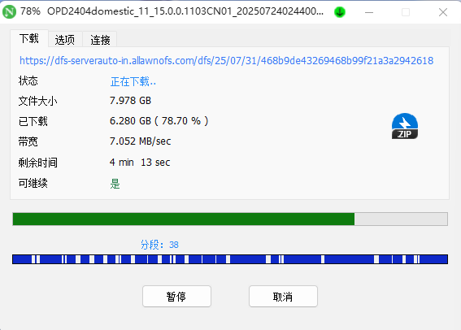

---

## 第三步：下载工具和引导（你可以使用多种工具，这里以@kr_white的工具为例）

本次使用的是 **@kr_white** 的工具，个人觉得很好用。
[工具下载链接](https://www.123865.com/s/XKfLVv-a9U0?notoken=1)

下载好工具后，还需要下载自己机型的引导文件：
* [引导文件下载](https://www.123865.com/s/XKfLVv-k9U0?notoken=1)
* [XDA 备用链接](https://xdaforums.com/t/oppo-oneplus-realme-qualcomm-files-share.4769736/)

*举例：我的平板是 8Gen3 的处理器，就选择 8Gen3 的文件。*

如图所示选择引导文件：
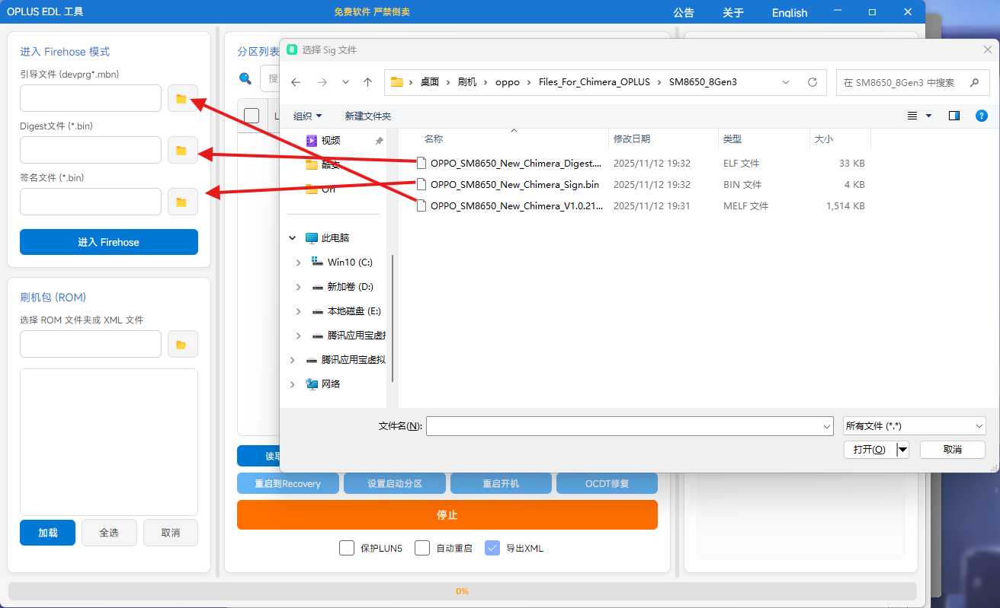

选择好后点击下一步，找到并选择刷机包文件夹：
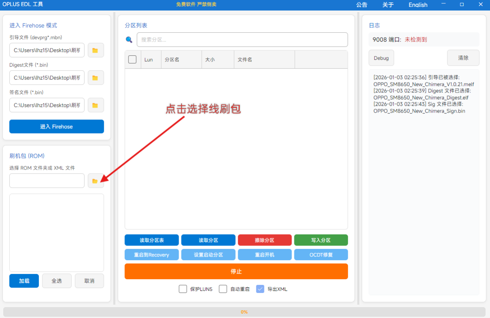
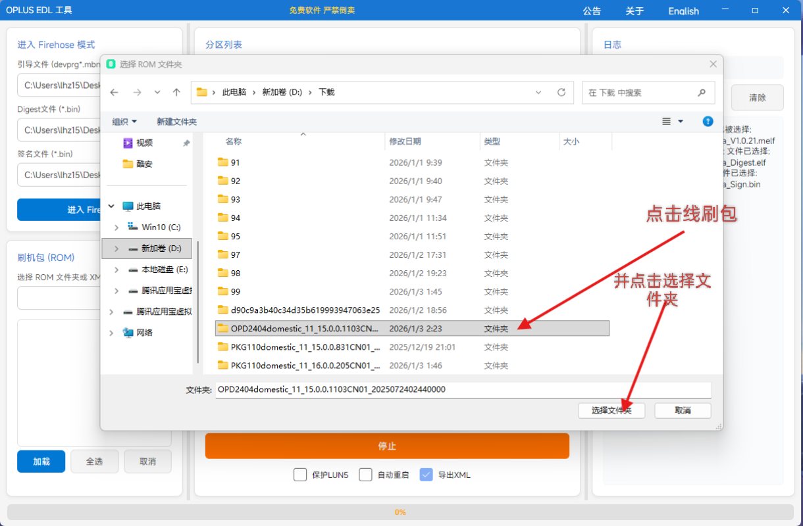

---

## 第四步：处理Super (Super 合并)

选择好后下一步是准备的最后部分——合并 Super。虽然现在支持子分区刷写，但看个人喜好。
* **合并 Super**：硬盘要有 30G 左右空间（本教程采用此方法）。
* **子分区刷写**：比较适合电脑配置一般或内存较少的情况。

**操作步骤：**
1. 弹出选项时选择合并：
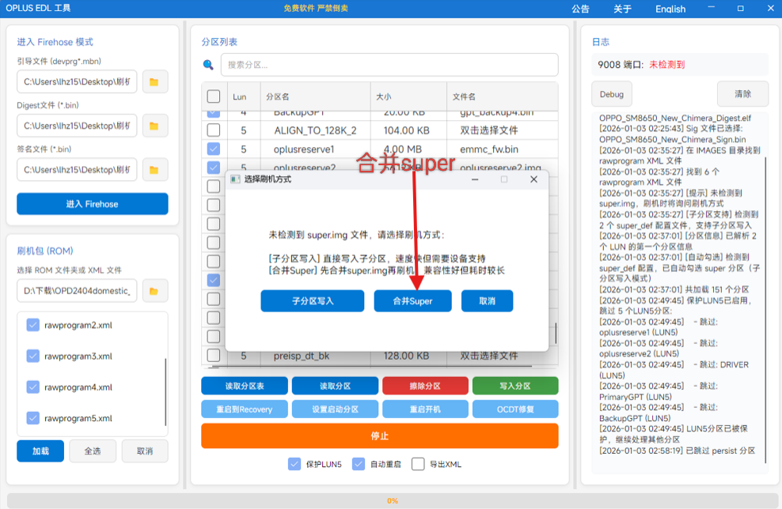

2. 等待合并进度条完成：
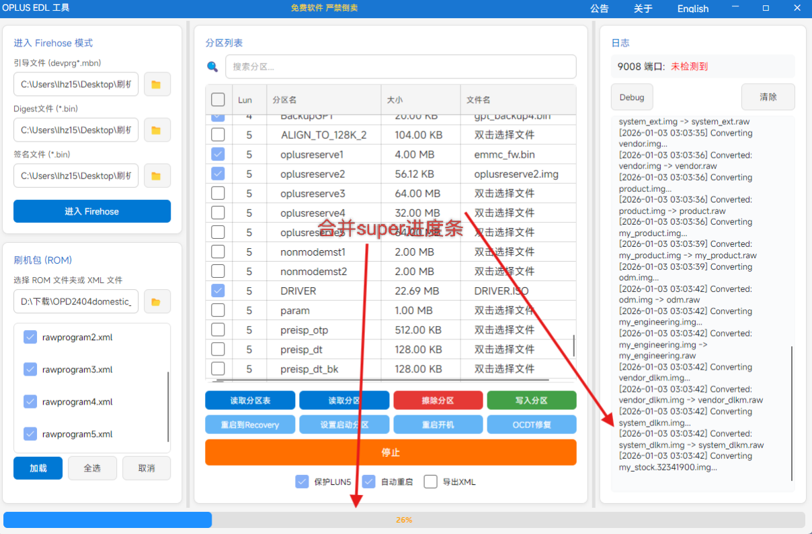

3. 确认刷写分区信息：
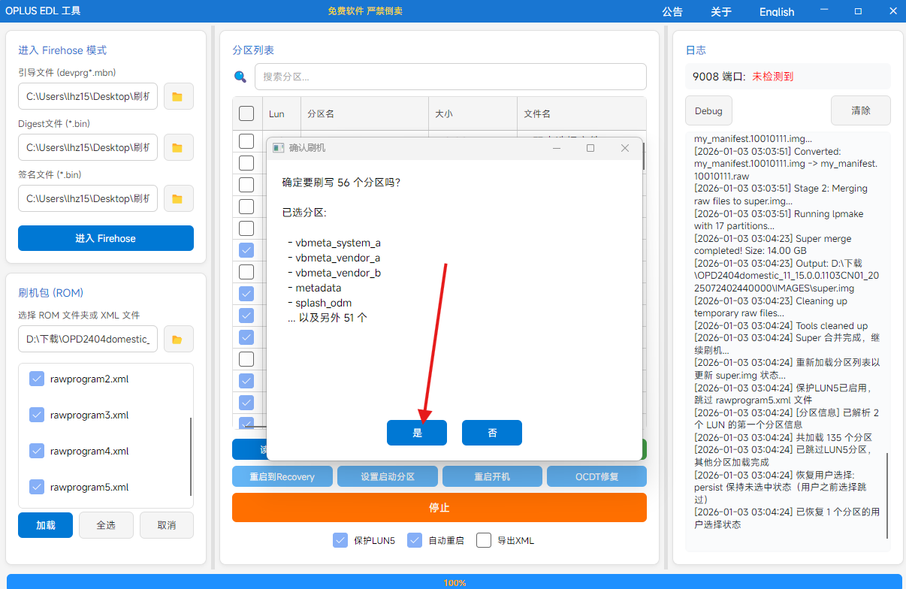

---

## 第五步：处理OCDT（如果你没有被格机，无需修复，如果被格了但提前备份过，直接刷自己备份的）

合并好了之后就开始准备救砖了。
* **OCDT 修复**：建议格机选择修复 OCDT（注意查看支持的机型列表）。
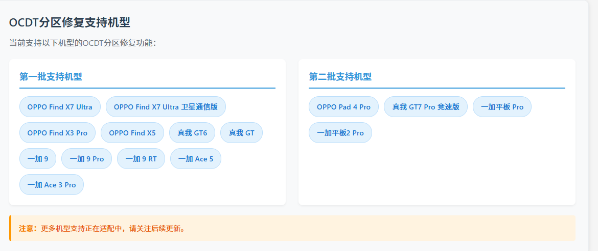 如果你的机器不支持且没备份过，其他深刷工具可能会有支持，但如果你使用了非本机的OCDT，你会无法进入Fastboot，所以一定要提前备份原机的OCDT。

* **保护 LUN5**：**这一点非常重要！！！一定要提前勾选“保护 LUN5”！**
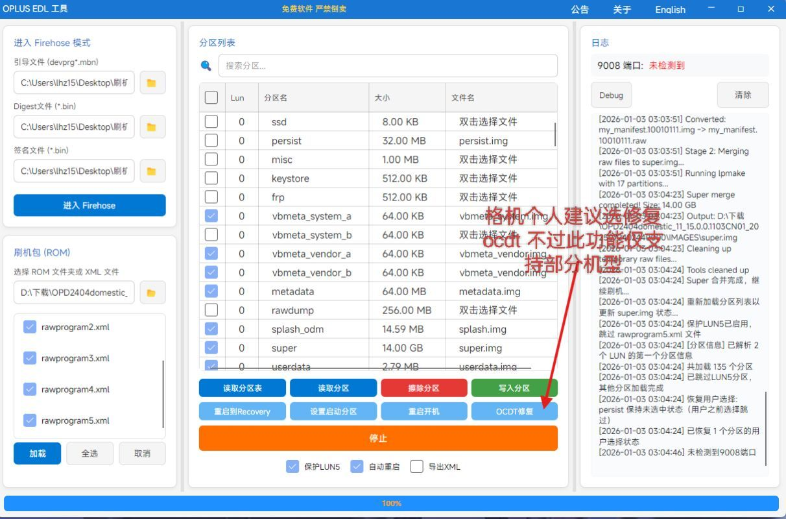

---

## 第六步：进入 9008 模式并刷机

1.  先打好驱动。
2.  拿数据线连接电脑。
3.  将手机完全关机。
4.  同时按住 **关机键 + 音量加 + 音量减** 三个键。如果你的机器卡一屏无限重启，无论如何也按不进9008，可以试试同时按电源和音量上12秒，再按音量上和音量下，也许能好。
5.  查看电脑设备管理器是否出现 **9008 端口**，且工具识别到设备。

识别成功后的状态：
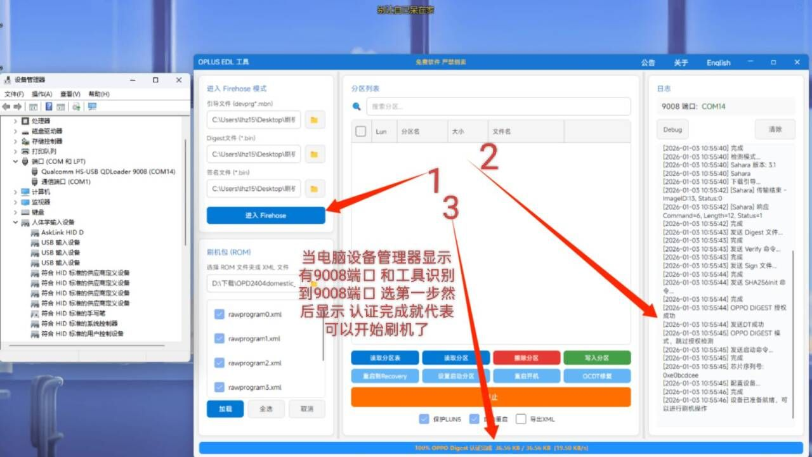

点击 **“写入分区”** 开始刷机：
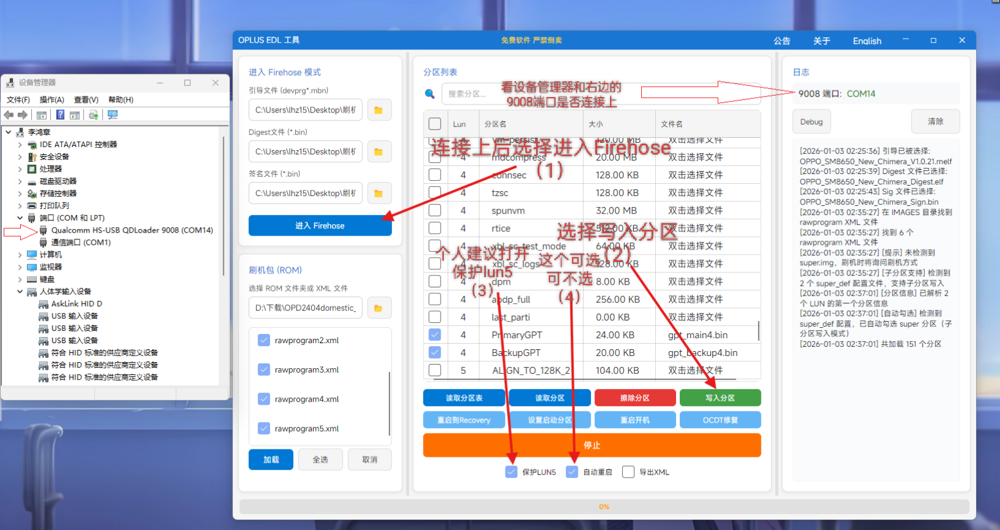

---

## 第七步：决定是否要刷写Persist分区

**关键的部分来了！**
如果在刷写过程中遇到关于 `persist` 分区的警告，请仔细阅读风险。
*(通常如果是救砖，可能需要根据实际情况选择，但请务必小心)*

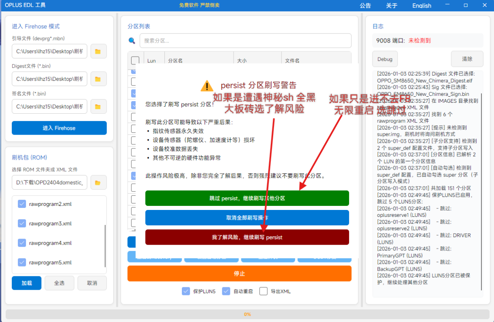

---

## 第八步：等待完成

开始刷机后，请耐心等待进度条走完。

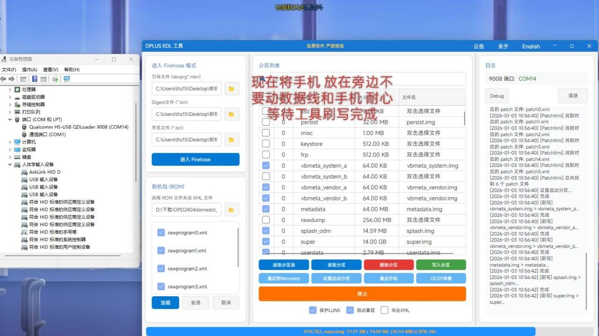

刷机完成后，工具会提示，手机会自动重启。

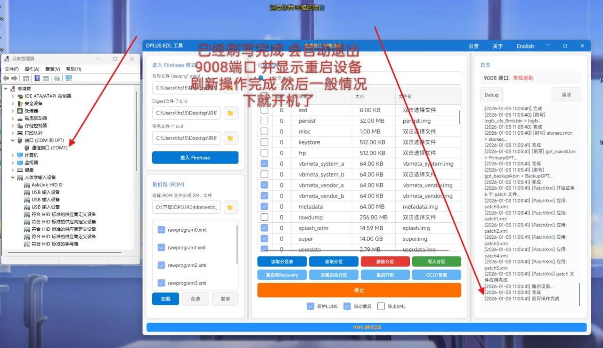

---

## 第九步：成功救砖

等待手机进入系统，恭喜你救砖成功！

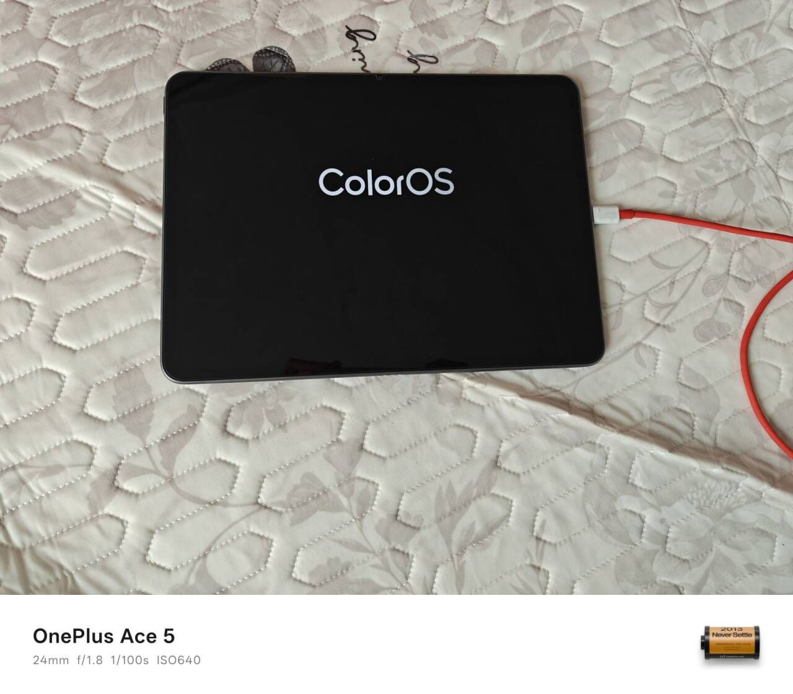
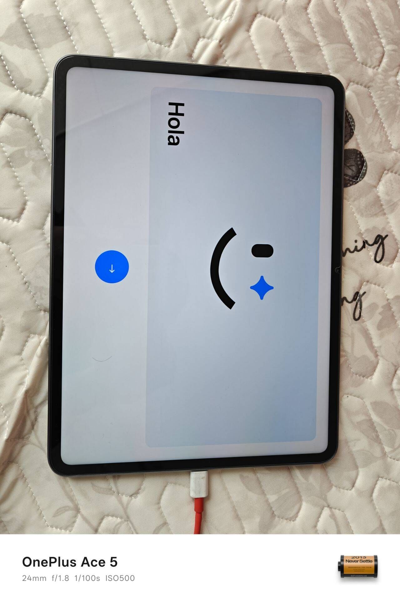
